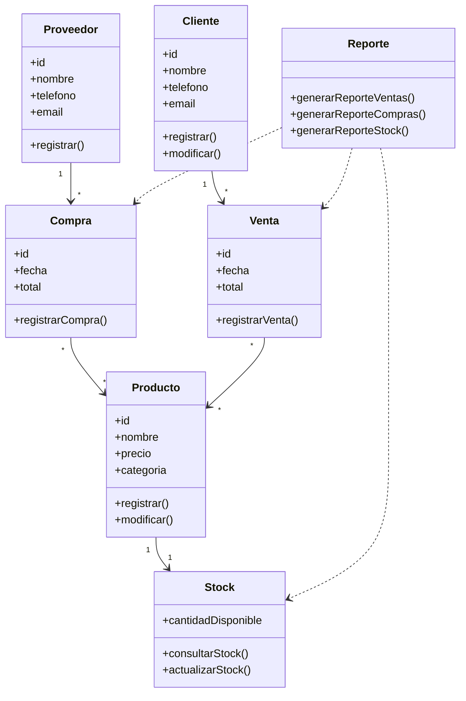

# Diagrama de Clases UML

```mermaid
classDiagram

class Cliente {
    +id
    +nombre
    +telefono
    +email
    +registrar()
    +modificar()
}

class Producto {
    +id
    +nombre
    +precio
    +categoria
    +registrar()
    +modificar()
}

class Proveedor {
    +id
    +nombre
    +telefono
    +email
    +registrar()
}

class Compra {
    +id
    +fecha
    +total
    +registrarCompra()
}

class Venta {
    +id
    +fecha
    +total
    +registrarVenta()
}

class Stock {
    +cantidadDisponible
    +consultarStock()
    +actualizarStock()
}

class Reporte {
    +generarReporteVentas()
    +generarReporteCompras()
    +generarReporteStock()
}

Cliente "1" --> "*" Venta

Proveedor "1" --> "*" Compra

Compra "*" --> "*" Producto

Venta "*" --> "*" Producto

Producto "1" --> "1" Stock

Reporte ..> Venta
Reporte ..> Compra
Reporte ..> Stock
```
