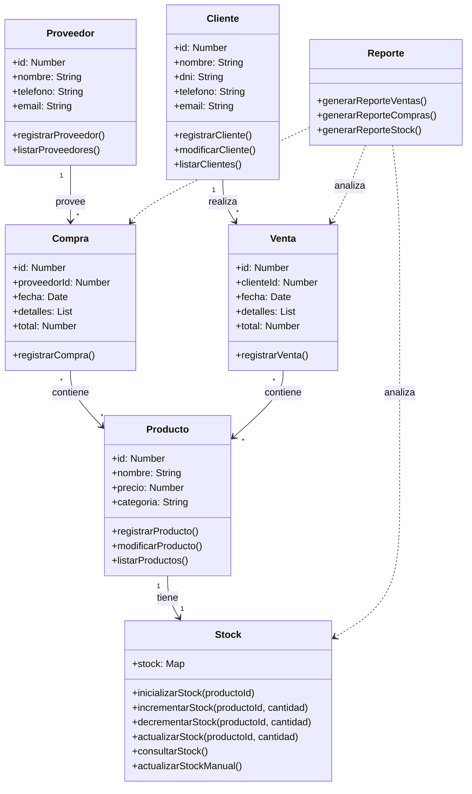

# Diagrama de Clases UML (Actualizado)

```mermaid
classDiagram

class Cliente {
    +id: Number
    +nombre: String
    +dni: String
    +telefono: String
    +email: String
    +registrarCliente()
    +modificarCliente()
    +listarClientes()
}

class Producto {
    +id: Number
    +nombre: String
    +precio: Number
    +categoria: String
    +registrarProducto()
    +modificarProducto()
    +listarProductos()
}

class Proveedor {
    +id: Number
    +nombre: String
    +telefono: String
    +email: String
    +registrarProveedor()
    +listarProveedores()
}

class Compra {
    +id: Number
    +proveedorId: Number
    +fecha: Date
    +detalles: List
    +total: Number
    +registrarCompra()
}

class Venta {
    +id: Number
    +clienteId: Number
    +fecha: Date
    +detalles: List
    +total: Number
    +registrarVenta()
}

class Stock {
    +stock: Map
    +inicializarStock(productoId)
    +incrementarStock(productoId, cantidad)
    +decrementarStock(productoId, cantidad)
    +actualizarStock(productoId, cantidad)
    +consultarStock()
    +actualizarStockManual()
}

class Reporte {
    +generarReporteVentas()
    +generarReporteCompras()
    +generarReporteStock()
}

Cliente "1" --> "*" Venta : realiza
Proveedor "1" --> "*" Compra : provee
Compra "*" --> "*" Producto : contiene
Venta "*" --> "*" Producto : contiene
Producto "1" --> "1" Stock : tiene
Reporte ..> Venta : analiza
Reporte ..> Compra : analiza
Reporte ..> Stock : analiza
```
